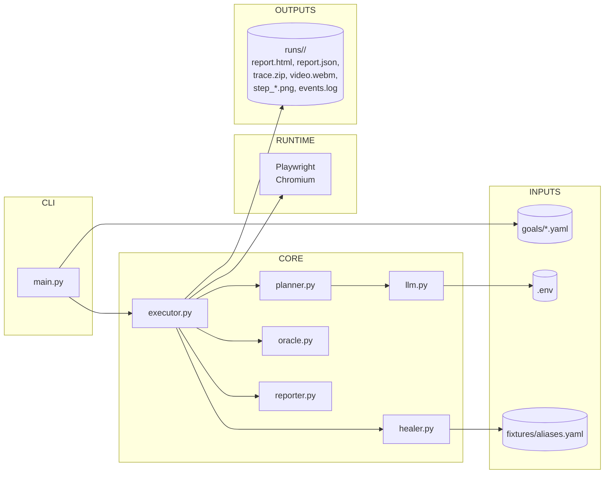
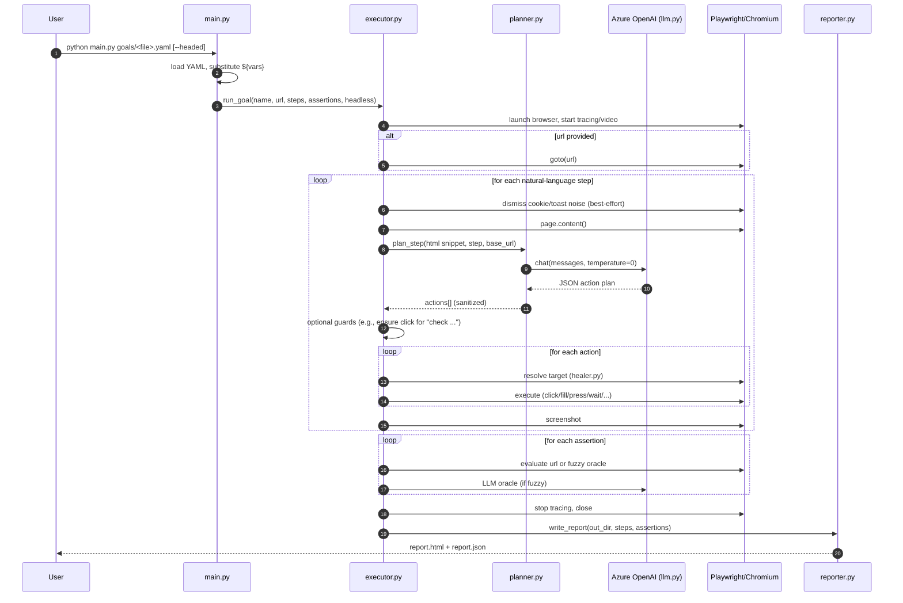

# playwright-use Architecture

## Overview
playwright-use turns natural-language UI test goals into executable Playwright steps using AI, then produces human-friendly and machine-readable reports with screenshots, video, and traces. It includes a self-learning alias system that caches successful hint→selector resolutions per host to reduce flakiness and manual maintenance over time.

- Tech stack: Python, Playwright (sync), Azure OpenAI, YAML, Jinja2
- Entry point: `main.py`
- Core modules: `core/executor.py`, `core/planner.py`, `core/healer.py`, `core/oracle.py`, `core/reporter.py`, `core/llm.py`

## Component Diagram

## End-to-End Flow

## Key Modules and Responsibilities
- `main.py`
  - CLI; loads goal YAMLs; `${var}` substitution; hands off to executor; prints artifacts path.
- `core/executor.py`
  - Orchestrates Playwright session (timeouts, tracing, video, viewport).
  - For each step: asks planner for actions; executes with resilient element resolution; screenshots; logging.
  - Supported actions: navigate, click, fill, press, wait_for(_selector), assert_text, assert_url_contains, select, combo_select, date_set, file_upload, hover, scroll_into_view, drag_and_drop.
  - Additional hardeners:
    - Dismiss common cookie/toast popups.
    - Scroll into view before input interactions.
    - Fill verification with keyboard fallback and blur/change events.
    - Interprets human hints for wait_for_selector via robust finders.
    - Checkbox normalization: prefers actual `input[type=checkbox]`, uses `check()` and verifies state; supports aria widgets.
    - Safeguard: injects a click if a "check ..." step produced no click action.
- `core/planner.py`
  - NL step → JSON action planning using Azure OpenAI; allow-list and sanitization; truncated DOM snippet for context; deterministic temperature.
- `core/healer.py`
  - Robust finders for inputs and clickable elements with prioritized strategies and self-learning:
    - Prefer roles, labels, placeholders, [data-test(id)], aria
    - Resolve inside iframes
    - Heuristics for username/password/email and zip/postal fields
    - Clickable resolution via role=button/link, :has-text, [data-test], attribute fallbacks (id/name/title/class), intent-based (cart/checkout/continue/finish), then clickable ancestor
    - Aliases: consult `fixtures/aliases.yaml` first; on successful resolution via heuristics, persist the mapping for future runs
- `core/oracle.py`
  - `assert_url_contains`; fuzzy oracle using heuristics or strict PASS/FAIL from LLM on truncated DOM.
- `core/reporter.py`
  - Generates `report.html` (Jinja2) and `report.json` with step/assertion details, timings, screenshots, plans, and errors.
- `core/llm.py`
  - Azure OpenAI ChatCompletion wrapper; reads `.env` for credentials and deployment.

## Configuration
- Environment (.env)
  - `AZURE_OPENAI_API_KEY`
  - `AZURE_OPENAI_ENDPOINT`
  - `AZURE_OPENAI_DEPLOYMENT`
  - `AZURE_OPENAI_API_VERSION` (default: 2024-08-01-preview)
- Playwright
  - Headed: maximized window; viewport inherits OS window size.
  - Headless: deterministic viewport (1280x800).

## Artifacts
- `runs/<GoalName_Timestamp>/`
  - `report.html`, `report.json`
  - `events.log`: step-by-step logs (requests, responses, console, plans, execution)
  - `trace.zip`: Playwright trace
  - `*.webm`: recorded session video
  - `step_*.png`, `step_fail_*.png`: screenshots per step

## Functional Behavior
- Goals: YAML with `name`, `url` (optional), `steps: [ { description } ]`, `assertions` (optional), `vars` (optional map for `${var}` substitution)
- Steps: natural-language intents (e.g., "Fill 'Email' with 'alice@example.com'", "Click 'Submit'", "Select 'Index' in combobox 'Interest'")
- Assertions: plain English (fuzzy oracle) or explicit URL fragment ("URL contains ...")

## Extension Points
- New action type: implement in `_run_action`, add to allow-list in `core/planner.py`, and update prompt (`PLAN_SYS`).
- New assertion: extend `core/oracle.py` and wire into executor assertion loop.
- Heuristics: add strategies in `core/healer.py` for more widgets (e.g., sliders, toggles, rich editors).

## Performance and Reliability Notes
- Resolution strategies are ordered: fast attribute/role selectors first, regex/text fallbacks last.
- DOM snippets to LLM are truncated to reduce latency and tokens.
- Fill actions verify values and trigger change/blur to engage validation.
- Waits interpret human hints with resolvers before falling back to raw selectors, avoiding brittle text-only waits.

## Security
- Store secrets in `.env` only; never commit credentials. No API keys are stored in repo.
- Azure OpenAI calls go to your configured endpoint.

## Troubleshooting
- If a wait times out on a hint (e.g., "Get in touch"), clicking may still proceed because clickable resolution is more robust; consider adjusting the step phrasing or rely directly on clicks.
- If a field ignores `.fill()`, the keyboard fallback + validation blur should resolve it. If not, increase pre-fill settle or add a focused `wait_for_selector` on the field label. 

## Packaging and CLI
- Installable as a Python package with a console entry point `smartui-ai`.
- Entry: `main.py:main` exposed via `console_scripts`.
- See README for build and publish steps. 
